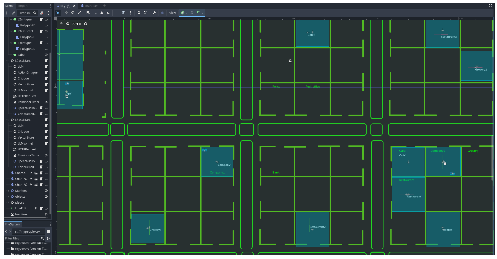
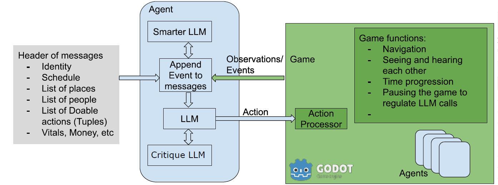
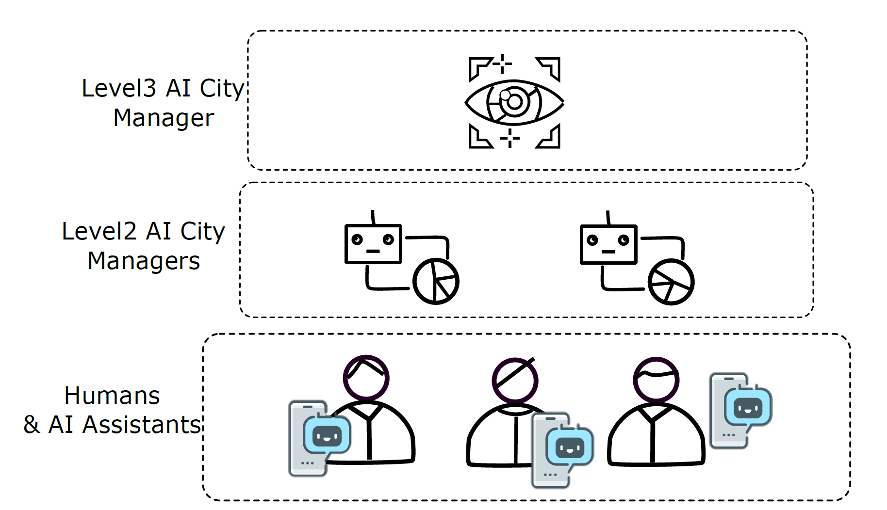

# Matrix_v0
This repo has the first version of our game engine-based and LLM-character-based city realistic simulator. Through continuous development, we aim to make this a large-scale simulator with hundreds of autonomous human-like agents to test specific scenarios and setups. 

Our broader vision includes studying **learning and evolution** when **LLM, RAG, and advanced reasoning** serve as the foundation for each human-like agent.

As the **first step**, we test our version with **online LLM APIs** and simulate a specific scenario discussed in our paper **[reference]**.

---

## City Layout Overview

  

<em>Figure 1: Initial city layout used in the simulation.</em>

---

## GitHub Interface and System Overview

  

<em>Figure 2: Overview of the system's GitHub integration.</em>

---

## Hierarchical Structure of Agents

  

<em>Figure 3: Hierarchical agent-based structure used in the simulation.</em>

