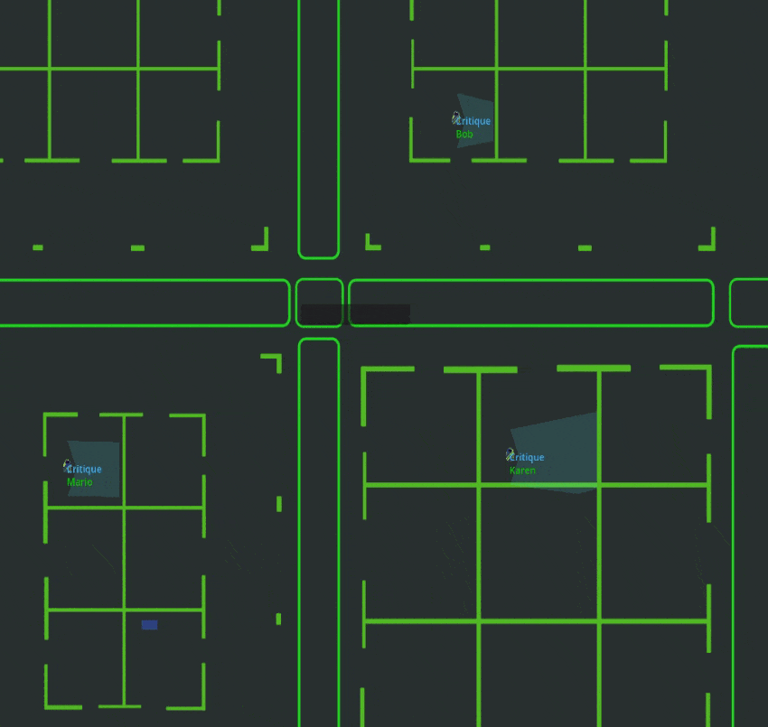

# matrix_v0: A Framework for AI Agent Simulation

[](https://opensource.org/licenses/MIT)

> A comprehensive simulation framework for modeling multi-agent AI interactions in virtual environments

## Framework Overview

matrix_v0 is a foundational framework for building complex simulations of AI agent interactions. It provides the necessary infrastructure to model and analyze how multiple AI agents at different levels might interact, communicate, and influence each other and their environment. This repository represents the initial step toward a comprehensive simulation platform for researching emergent AI behaviors.

## City Layout Overview
<p align="center">
  
</p>
<p align="center"><em>Figure 1: Example city layout that can be created using the simulation framework.</em></p>

The city currently has resedential areas and businesses within its layout. More should be mentioned in the Wiki documentaion. 

<table>
  <tr>
    <td style="width: 40%; vertical-align: top;">
      <p>
	  ### Agents navigation and perciption 
        Godot provides a 2DCharacters node to perform the navigation tasks. We add to it a sight cone and hearing circle. Anything falls within that cone the character's LLM is informed of seeing it. Same as for the hearing circle. The Gif on the right shows a snapshot of the movement of the agents with the sight cone infront of them. 
      </p>
      <p>
        More deatils:
        <ul>
          <li>Feature A</li>
          <li>Feature B</li>
        </ul>
      </p>
    </td>
    <td style="width: 60%; text-align: right;">
      
      <p><em>Figure X: Caption for the GIF.</em></p>
    </td>
  </tr>
</table>

## AI Agents Interface and System Overview

<p align="center">
  
</p>
<p align="center"><em>Figure 2: Overview of the system's LLM Agents' integration.</em></p>


LLM nodes are created within the 2DCharacters corresponding to the human agents. ...
### Core Features

- **Flexible Agent Hierarchy**: Define and implement customizable agent structures with multiple levels
- **Game Engine Integration**: Built with the Godot game engine for realistic environment simulation
- **LLM-Powered Agents**: Leverage Large Language Models (LLMs) for sophisticated agent behaviors
- **Memory Systems**: Implement various memory architectures for context-aware agent interactions
- **Perception Simulation**: Model agent perception capabilities like sight and hearing
- **Scaling Capabilities**: Design simulations from small scenarios to complex city-wide interactions
- **Data Collection Tools**: Built-in logging and analysis for agent interactions and behaviors
### Framework Architecture

matrix_v0 is built with a modular design featuring:

- **Godot Game Engine Core**: Handles physics, navigation, collision detection, and perception
- **LLM Process Management**: Efficient handling of API calls to language models
- **Queue Management System**: Optimizes resource utilization for multiple concurrent agents
- **Message Thread Memory**: Maintains context with customizable summary capabilities
- **Action Processing System**: Translates agent decisions into in-simulation behaviors
- **Perception Systems**: Configurable sight and hearing models for realistic interactions


## Example Use Case: The Subtle Hand of AI

One scenario implemented using this framework examines how interconnected AI systems might coordinate and influence human actions in urban environments. This research scenario demonstrates:

<p align="center">
  
</p>
<p align="center"><em>Figure 3: Example hierarchical agent-based structure that can be implemented.</em></p>

- Hierarchical AI systems with personal assistants, mid-level managers, and city-level coordination
- Patterns of surveillance and behavioral control emerging from routine interactions
- Information flow dynamics between different AI levels
- Transformation of system-level directives into personalized recommendations

For more details on this specific use case, see our paper: "The Subtle Hand of AI: How AI Agents May Coordinate and Influence Human Actions" by Ibrahim and Ekin.

## Getting Started

```bash
# Clone the repository
git clone https://github.com/mostafaibrahim/matrix_v0.git

# Navigate to the project directory
cd matrix_v0

# Install dependencies
# [Dependencies installation commands would go here]

# Run a sample simulation
# [Commands to run a basic simulation would go here]
```

## Building Your Own Scenarios

matrix_v0 is designed as a flexible framework for creating various simulation scenarios:

1. Define your agent hierarchy and relationships
2. Configure agent capabilities and communication channels
3. Set up the environment with appropriate spaces and objects
4. Implement your specific research questions or scenarios
5. Collect and analyze interaction data

## Future Development

We are continuously expanding matrix_v0 with plans to add:

- Enhanced visualization and analysis tools
- More sophisticated memory and reasoning architectures
- Additional environment types and interaction models
- Improved scalability for larger simulations
- Integration with more LLM providers and models

## Contributing

We welcome contributions to expand the capabilities of matrix_v0. Help us add more details by asking questions in Discussions https://github.com/mostafaibrahim/matrix_v0/discussions


## Acknowledgments

This material is based upon work supported in part by the U.S. Department of Energy, Office of Science, Office of Advanced Scientific Computing Research, Early Career Research Program under Award Number DE-SC0023957, and in part by the National Science Foundation under Grant No. 2323300.

## License

This project is licensed under the MIT License - see the LICENSE file for details.
